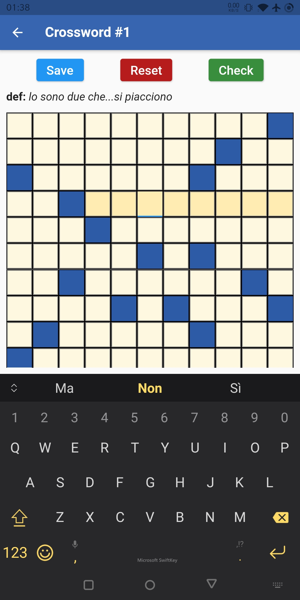

###### ***UPDATE: app is almost completed! Just needs more crosswords and minor features!***

# CruciApp

#### This is a Flutter project: a cross-platform app for solving crosswords.

## Home page:
renders a list of tiles, each showing information about a crossword: its **number, title, description, language** and **dimensions.**

## Side menu:
accessed by tapping on a top-left button. Contains basic links to the [browser version](https://filippopaganelli.github.io/crosswords.html), to this repository, to [my website](https://filippopaganelli.github.io/) and e-mail.

## Crossword page:
every crossword tile leads to its page. It contains three buttons for **saving, resetting and checking** the grid's state, the grid for the actual crossword.

## Todo:
basic points:
- [x] home page
- [x] side menu
- [x] working links
- [x] crossword page *(CWPage)*
- [x] route generator
- [x] toasts + vibrations
- [ ] completed cws badge *(?)*
- [ ] android splashscreen

CWPage details:
- [x] working Save button + previous state reading
- [x] working Reset button + confirmation alert
- [x] working Check button + check info alert
- [x] blank grid with white/dark cells
- [x] words *(vertical/horizontal)* highlighting
- [x] words insertion in both direction *(!issue with overwriting letters)*
- [x] proper definition textbox

## Snapshots:

| Home page  | Side menu | Cw page |
| ------------- | ------------- | ------------- |
|  |  |  |

*...further updates will come soon...*
