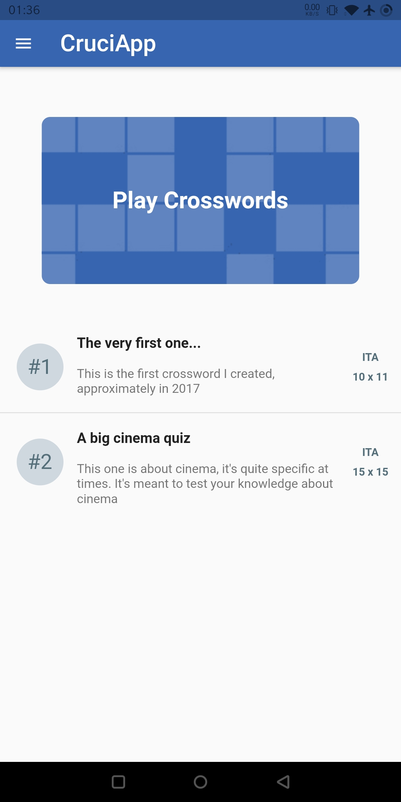
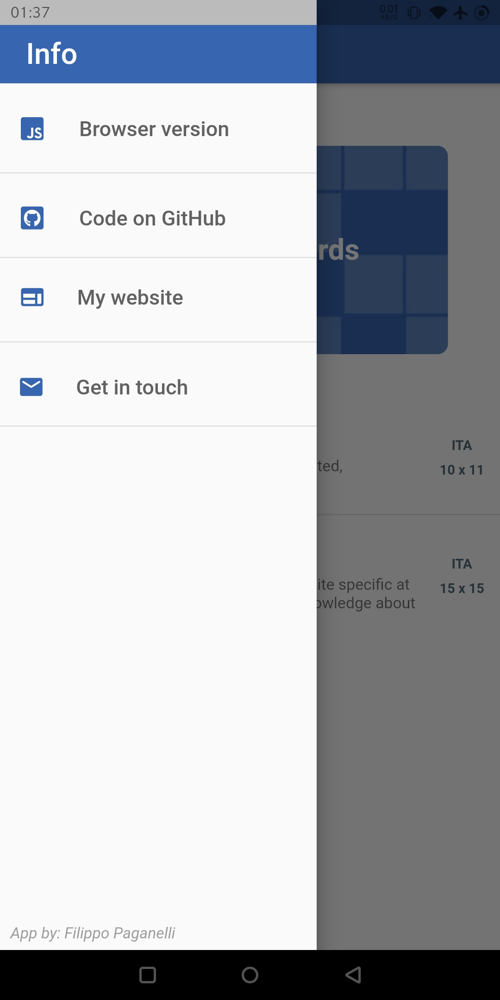

# CruciApp

### This is a Flutter project for a cross-platform app for solving crosswords.

At the moment, the HomePage just renders a list of tiles, each showing information about a crossword (its number, title, description, language and *soon* its dimensions). 
Here's a snapshot of the current working prototype:

There's also a side menu with basic links (to the [browser version](https://filippopaganelli.github.io/crosswords.html), to this repository, to [my website](https://filippopaganelli.github.io/) and e-mail).
Here's a snapshot of the HomePage with the open menu:

*Further updates will come soon...*
